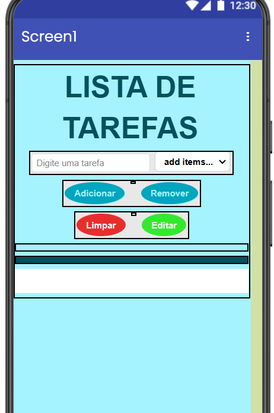
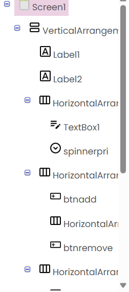
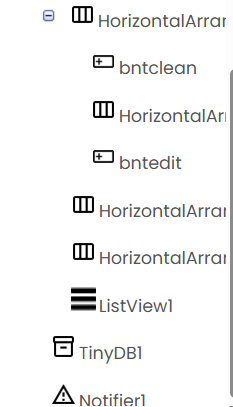

## Instituição
Etec Vasco Antônio Venchiarutti

## Curso
Informática para Internet

## Turma
 2º D

## Autores
Laura Duarte Arruda dos Santos

Nicolas Saraiva Batista

Pedro Coraine

Pedro Henrique Nascimento Rodrigues

---

## Objetivo do aplicativo

 O objetivo do nosso aplicativo autoral é oferecer uma lista de tarefas simples, intuitiva e de fácil utilização para todos os usuários. Por meio dele, é possível adicionar diversas tarefas e organizá-las de acordo com seu nível de prioridade, classificando-as como comum, importante ou urgente.

Além disso, o aplicativo permite editar tanto o conteúdo das tarefas quanto sua classificação de prioridade, proporcionando maior flexibilidade para acompanhar mudanças na rotina do usuário. Após a conclusão de uma atividade, também é possível excluí-la da lista, seja individualmente ou utilizando a opção "Limpar", que remove todas as tarefas de uma só vez.

Com essa proposta, o aplicativo busca facilitar a organização das atividades diárias, tornando o gerenciamento de tarefas mais prático, eficiente e acessível.

## Funcionalidades opcionais

As funcionalidades opcionais implementadas no aplicativo foram a classificação de prioridade das tarefas, permitindo categorizá-las como comum, importante ou urgente; a funcionalidade de edição, que possibilita ao usuário alterar tanto o conteúdo quanto a prioridade de uma tarefa já cadastrada; e o aprimoramento da interface gráfica (design), com o objetivo de proporcionar uma experiência mais intuitiva, organizada e agradável durante a utilização do aplicativo.

## Design 

## Elementos

## Design no celular

## Blocos