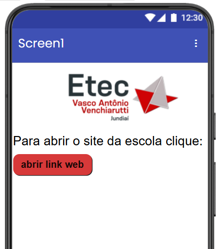
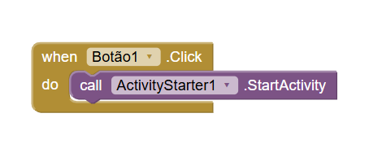
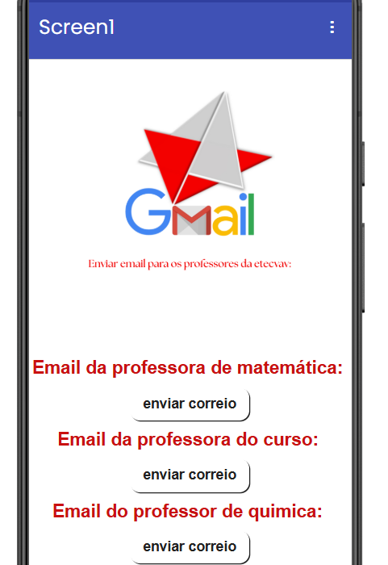
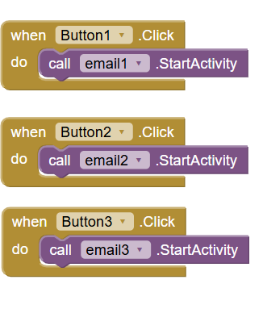

## Instituição
Etec Vasco Antônio Venchiarutti

## Curso
Informática para Internet

## Turma
 2º D

## Autores
Laura Duarte Arruda dos Santos
Nicolas Saraiva Batista

---

# Componentes avançados 1

## Projeto 1 – Web

### Descrição

O objetivo deste projeto é proporcionar um acesso rápido e prático ao site oficial da escola ETECVAV por meio de um aplicativo desenvolvido no MIT App Inventor. Ao clicar no botão disponível na interface do app, o usuário é direcionado automaticamente para o site designado, facilitando a navegação e o acesso às informações escolares.

### Print das telas do Design

### Design no celular

### Print das telas dos Blocos

---

## Projeto 2 – Correio

### Descrição

O objetivo deste aplicativo é facilitar o envio de e-mails aos professores da ETECVAV de maneira rápida e prática. Desenvolvido no MIT App Inventor, o app permite que os alunos tenham acesso direto ao email dos professores, tornando a comunicação escolar mais simples e organizada.

### Print das telas do Design

### Design no celular

### Print das telas dos Blocos

---

# Componentes avançados 2

## Projeto 3 – 

### Descrição

 

### Design no celular

### Print das telas dos Blocos

---

## Projeto 4 – 

### Descrição

### Print das telas do Design

### Design no celular

### Print das telas dos Blocos

---